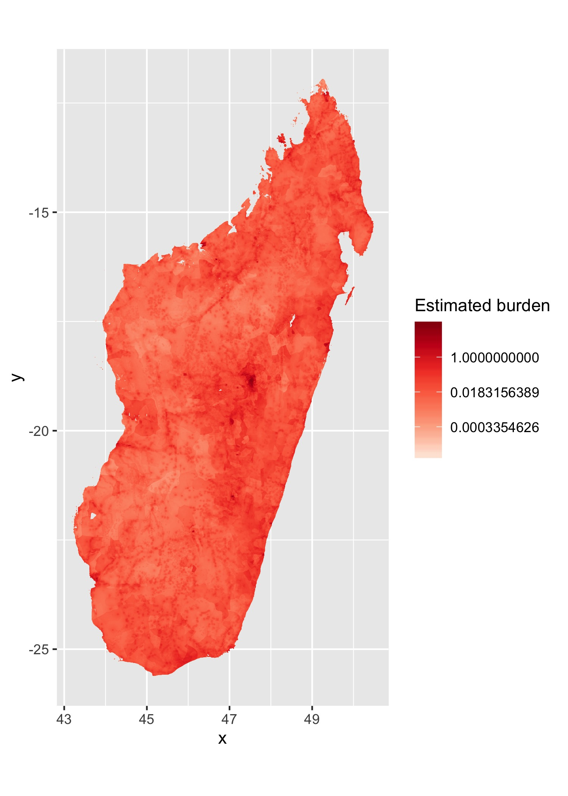

```{r setup, include=FALSE}
knitr::opts_chunk$set(echo = TRUE)
library(rgdal)
library(malariaAtlas)
library(rmapshaper)
library(raster)
library(ggplot2)
library(doParallel) 
library(foreach)
library(iterators)
library(glue)
library(data.table)
library(dplyr)
library(knitr)
```

## Two sources of data from WorldPop

- [Africa Continental (@ 1x1 km distribution)](https://www.worldpop.org/geodata/summary?id=1276)
    - 0 - 65 in 5 year intervals, 65+ is one age group
    
- [Country level (~ 100m resolution)](https://www.worldpop.org/geodata/summary?id=16870)]
    - 0 - 1, 1 - 80 in 5 year intervals, 80+ is one age group
    - If you want to download data for another country, you can use the `wp_age.sh` bash script included here. From your working directory:
    
    ``` 
    bash wp_age.sh {output directory} {isocode} {yr}
    ```
    For example:
    ```
    bash wp_age.sh mada_age MDG 2020
    ```
      -  You will need to have GNU [`parallel`](https://www.gnu.org/software/parallel/)  and [`curl`](https://curl.haxx.se) installed, to use this script.
    - Then edit the script [R/mada_1x1.R](R/mada_1x1.R) with the new directories & iso code
    - A table of country iso codes is included [here](output/iso_codes.csv)

- Shapefiles from malariaAtlas using the [R package](https://cran.r-project.org/web/packages/malariaAtlas/index.html)
    - I used rmapshaper to simplify polygons for easier plotting (except for admin3 which was too big!)
    - The continental shapefiles are a bit patchy and you end up with some invalid geoms

**Spatial files and other large files are stored on dropbox!**
- [Download here](https://www.dropbox.com/sh/wwxc9wb2xpv5qog/AACSsRjpq4Skesoy0Ijzt2I9a?dl=0)

## Analysis 

For both Madagascar @ ~ 1x1 km scale and AFR at  ~ 10 km scale:  

1. Aggregate rasters up to make them easier to work with
2. Add male and female populations in each age group
3. Match to admin codes (country iso code, admin 1 - 3) from MalariaAtlas shapefiles
4. Apply cfrs across age groups

## Key outputs

These data (zipped csv files) with cell_id corresponding to raster &  admin codes corresponding to shapefiles:

- Africa gridded @ 10x10 km: [output/afr_dt.gz](output/afr_dt.gz)
- Mada gridded @ 1x1km: output/mada_dt.gz (stored on dropbox)

The aggregated versions are also included in the output folder (may be easier to work with).  You can match these to the shapefiles and apply models and plot however! Although mapping to admin units for African continent is very slow. If working with the gridded datasets, I  would recommend using data.table as these are large and can be a pain to read in and manipulate otherwise. 

## Plotting examples
- Script [here](R/plotting.R)
- Estimate cfrs per Jess (smooth spline)
- Assumed infection prop of 0.4 cummulatively & asymptomatic proportion is 0.2

- Continent (at grid cell level)
```{r, out.width = "60%"}
include_graphics("figs/afr_deaths_grid.jpeg")
```

- Continent (at admin level, not all countries have admin3 or even admin2 data in malariaAtlas so would need to download individual country sources, right now just using admin 2)
```{r, out.width = "60%"}

```

- Mada grid cell
```{r, out.width = "60%"}

```

- Mada admin 3
```{r, out.width = "60%"}
include_graphics("figs/mada_deaths_admin3.jpeg")
```

**Right now, the maps are basically just pop maps!**

## Next steps
What metric should we look at? Incidence of deaths?

Hospital/health capacity data? [Maina et al.](https://www.nature.com/articles/s41597-019-0142-2)

What does bed capacity even mean in these settings?

- Better way to get estimate of cfr for age bins? Particularly for the higher binned age groups (i.e. 65 +, 80 +)
- Check which source is more accurate against pop totals from census data 
    - As an example with the finer scale/newer data vs. the older continent data for Tana pop #s, what does this look like?
    - I think the older data may actually be more accurate!
- Matching to admin units is trickier than gridded cells because some people inevitably go missing...

## Session Info
``` {r}
sessionInfo()
```
