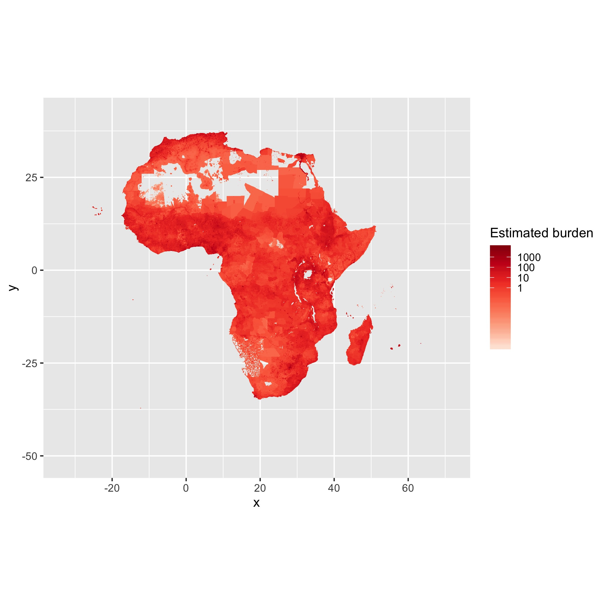
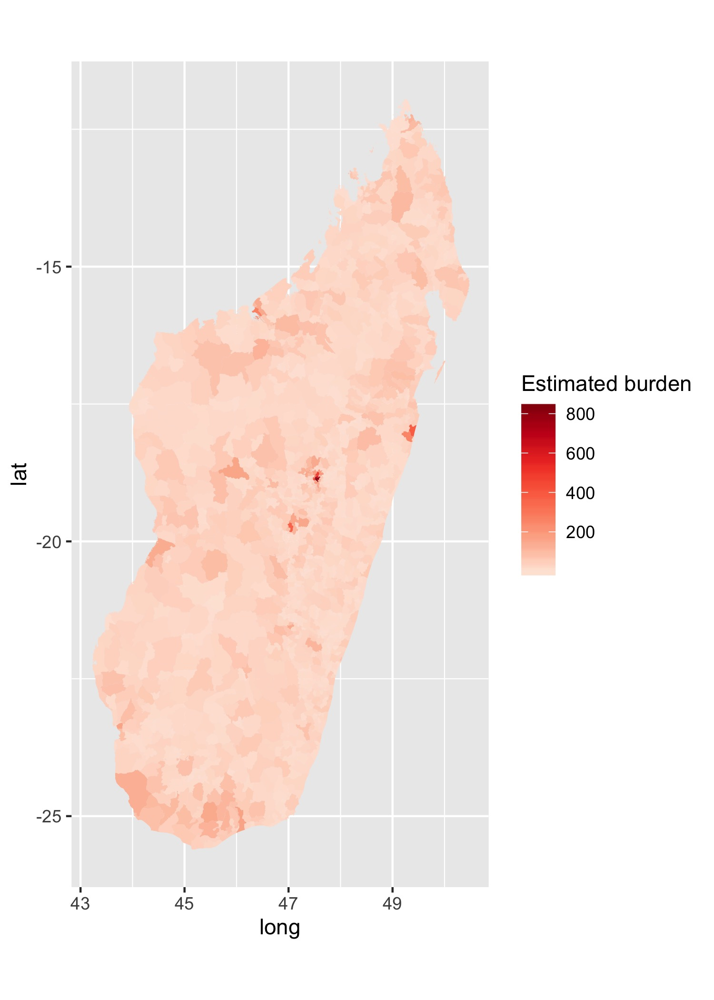

Spatial estimates of burden by age cfrs for Africa
================
4/1/2020

---
This project is aimed at projecting and mapping the expected Covid-19 burden in Africa, based on population age distributions. For a similar project focusing on the USA, see <a target="_blank" href="https://github.com/ianfmiller/covid19-burden-mapping">this page</a>. For an interactive tool of our project, see <a target="_blank" href="https://marjoleinbruijning.shinyapps.io/covid19-burden-africa/">here</a>.

---
## Table of Contents
* [Data sources](#data)
* [Analysis](#analysis)
  * [Calculations](#calculations)
  * [Output Files](#output files)
  * [Code](#code)
* [Preliminary results](#results)
* [Next Steps](#next steps)
* [Session Info](#session-info)

---

## Data
We use two sources of data from WorldPop:

  - [Africa Continental (@ 1x1 km
    distribution)](https://www.worldpop.org/geodata/summary?id=1276)
      - 0 - 65 in 5 year intervals, 65+ is one age group
  - [Country level (\~ 100m
    resolution)](https://www.worldpop.org/geodata/summary?id=16870)\]
      - 0 - 1, 1 - 80 in 5 year intervals, 80+ is one age group
      - If you want to download data for another country, you can use
        the `wp_age.sh` bash script included here. From your working
        directory:
    <!-- end list -->
        bash wp_age.sh {output directory} {isocode} {yr}
    For example: `bash wp_age.sh mada_age MDG 2020` - You will need to
    have GNU [`parallel`](https://www.gnu.org/software/parallel/) and
    [`curl`](https://curl.haxx.se) installed, to use this script.
      - Then edit the script [R/mada\_1x1.R](R/mada_1x1.R) with the new
        directories & iso code
      - A table of country iso codes is included
        [here](output/iso_codes.csv)
  - Shapefiles from malariaAtlas using the [R
    package](https://cran.r-project.org/web/packages/malariaAtlas/index.html)
      - I used rmapshaper to simplify polygons for easier plotting
        (except for admin3 which was too big\!)
      - The continental shapefiles are a bit patchy and you end up with
        some invalid geoms

**Spatial files and other large files are stored on dropbox\!** -
[Download
here](https://www.dropbox.com/sh/wwxc9wb2xpv5qog/AACSsRjpq4Skesoy0Ijzt2I9a?dl=0)


---

## Analysis

### Calculations
For both Madagascar @ \~ 1x1 km scale and AFR at \~ 10 km scale:

1.  Aggregate rasters up to make them easier to work with
2.  Add male and female populations in each age group
3.  Match to admin codes (country iso code, admin 1 - 3) from
    MalariaAtlas shapefiles
4.  Apply cfrs across age groups


---

### Output files

These data (zipped csv files) with cell\_id corresponding to raster &
admin codes corresponding to shapefiles:

  - Africa gridded @ 10x10 km: [output/afr\_dt.gz](output/afr_dt.gz)
  - Mada gridded @ 1x1km: output/mada\_dt.gz (stored on dropbox)

The aggregated versions are also included in the output folder (may be
easier to work with). You can match these to the shapefiles and apply
models and plot however\! Although mapping to admin units for African
continent is very slow. If working with the gridded datasets, I would
recommend using data.table as these are large and can be a pain to read
in and manipulate otherwise.

---

### Code


--- 
## Preliminary Results

  - Script [here](R/plotting.R)

  - Estimate cfrs per Jess (smooth spline)

  - Assumed infection prop of 0.4 cummulatively & asymptomatic
    proportion is 0.2

  - Continent (at grid cell level)

<!-- end list -->

``` r

```


  - Continent (at admin level, not all countries have admin3 or even
    admin2 data in malariaAtlas so would need to download individual
    country sources, right now just using admin 2)

<!-- end list -->

``` r
include_graphics("figs/afr_deaths_admin2.jpeg")
```


  - Mada grid cell

<!-- end list -->

``` r
include_graphics("figs/mada_deaths_grid.jpeg")
```


  - Mada admin 3

<!-- end list -->

``` r

```


**Right now, the maps are basically just pop maps\!**

---

## Next steps

What metric should we look at? Incidence of deaths?

Hospital/health capacity data? [Maina et
al.](https://www.nature.com/articles/s41597-019-0142-2)

What does bed capacity even mean in these settings?

  - Better way to get estimate of cfr for age bins? Particularly for the
    higher binned age groups (i.e. 65 +, 80 +)
  - Check which source is more accurate against pop totals from census
    data
      - As an example with the finer scale/newer data vs. the older
        continent data for Tana pop \#s, what does this look like?
      - I think the older data may actually be more accurate\!
  - Matching to admin units is trickier than gridded cells because some
    people inevitably go missing…


---

## Session Info

``` r
sessionInfo()
```

    ## R version 3.6.1 (2019-07-05)
    ## Platform: x86_64-apple-darwin15.6.0 (64-bit)
    ## Running under: macOS Mojave 10.14.6
    ## 
    ## Matrix products: default
    ## BLAS:   /Library/Frameworks/R.framework/Versions/3.6/Resources/lib/libRblas.0.dylib
    ## LAPACK: /Library/Frameworks/R.framework/Versions/3.6/Resources/lib/libRlapack.dylib
    ## 
    ## locale:
    ## [1] en_US.UTF-8/en_US.UTF-8/en_US.UTF-8/C/en_US.UTF-8/en_US.UTF-8
    ## 
    ## attached base packages:
    ## [1] parallel  stats     graphics  grDevices utils     datasets  methods  
    ## [8] base     
    ## 
    ## other attached packages:
    ##  [1] knitr_1.27         dplyr_0.8.3        data.table_1.12.4  glue_1.3.1        
    ##  [5] doParallel_1.0.15  iterators_1.0.12   foreach_1.4.7      raster_3.0-7      
    ##  [9] rmapshaper_0.4.3   malariaAtlas_0.0.4 ggplot2_3.2.1      rgdal_1.4-6       
    ## [13] sp_1.3-1          
    ## 
    ## loaded via a namespace (and not attached):
    ##  [1] Rcpp_1.0.3         pillar_1.4.2       compiler_3.6.1     tools_3.6.1       
    ##  [5] digest_0.6.23      jsonlite_1.6       evaluate_0.14      tibble_2.1.3      
    ##  [9] gtable_0.3.0       lattice_0.20-38    pkgconfig_2.0.3    rlang_0.4.4       
    ## [13] crul_0.9.0         curl_4.2           yaml_2.2.0         xfun_0.12         
    ## [17] withr_2.1.2        stringr_1.4.0      geojsonlint_0.3.0  grid_3.6.1        
    ## [21] tidyselect_0.2.5   jsonvalidate_1.1.0 httpcode_0.2.0     R6_2.4.1          
    ## [25] rmarkdown_2.1      purrr_0.3.2        magrittr_1.5       codetools_0.2-16  
    ## [29] scales_1.0.0       htmltools_0.4.0    assertthat_0.2.1   colorspace_1.4-1  
    ## [33] V8_3.0             stringi_1.4.5      lazyeval_0.2.2     munsell_0.5.0     
    ## [37] crayon_1.3.4
